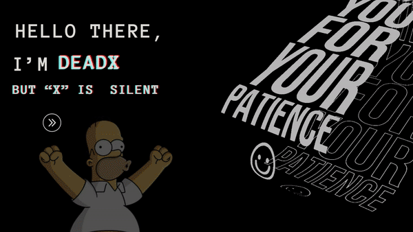

<table style="border: none; border-collapse: collapse; width: 100%;">
  <tr style="border: none;">
    <td style="border: none;">
      
👋 Hi, I’m @Deadx 👾

      
👀 I’m interested in peace and quiet

      
🌱 I’m currently learning SE

      
💞️ I’m looking to collaborate on success

      
📫 How to reach me: isurushehan393@gmail.com

      
😄 Pronouns: observant

      
⚡ Fun fact: My nightmare is "HELLO WORLD"

    </td>
    <td style="border: none;">
      
    </td>
  </tr>
</table>

<!---
Deadx34/Deadx34 is a ✨ special ✨ repository because its `README.md` (this file) appears on your GitHub profile.
You can click the Preview link to take a look at your changes.
--->

  

 

 

---

  
  

